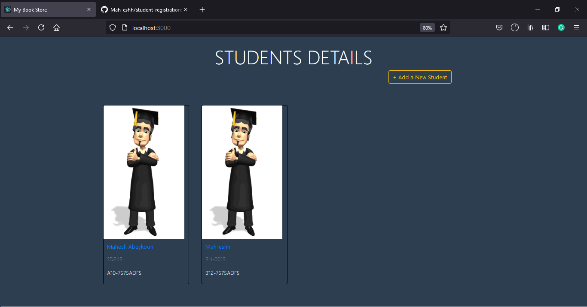

<!-- PROJECT LOGO -->
 

  <h1 align="center">Student Registration form ✨</h1>

  

    This is a very simple student registration Web Application, which was created by me using the MERN stack. 
    <a href="https://Mah-eshh.github.io">Mah-eshh.github.io</a>
     
     
   
  

